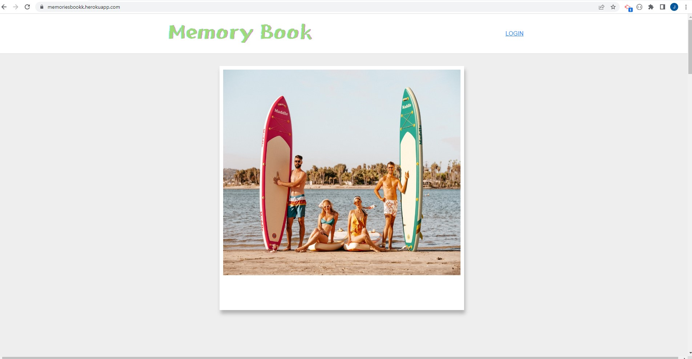

# Memories Book

An app that let user share their memories or moments anonymously.

## User Story

2022 has been the year of the Y2K revival, seen this fashion trends coming back we were inspired by all of it, and thinking of were technology was we immediatly thought of myspace a place where you could share post pictures and keep in contact with friends and even strangers on the web, based on that we created an app that would have similar functionality but it would be different enough to stand on its own.

## Description

The purpose of this application is for user to share their memories or moments, not only that user can also view other people's memories and moments as well, no infomation shared just simply speak your mind anonymously. This app is deployed on [Heroku](https://memoriesbookk.herokuapp.com/) .

## Table of Contents

* [Installation](#installation)
* [Usage](#usage)
* [Deployment](#deployment)

## Installation
 There are several ways to run this app. First, user can run app by using the Heroku link provided below in deployement section. Second, if user want to use this app locally then user needs to install all the dependencies and use " node sever.js " in the command line then access 
 'localhost:3001'. Also set the infomation for the mySQL connection in .env folder
 

## Usage 

When run the app, user will lead to a introduction page to get started.

